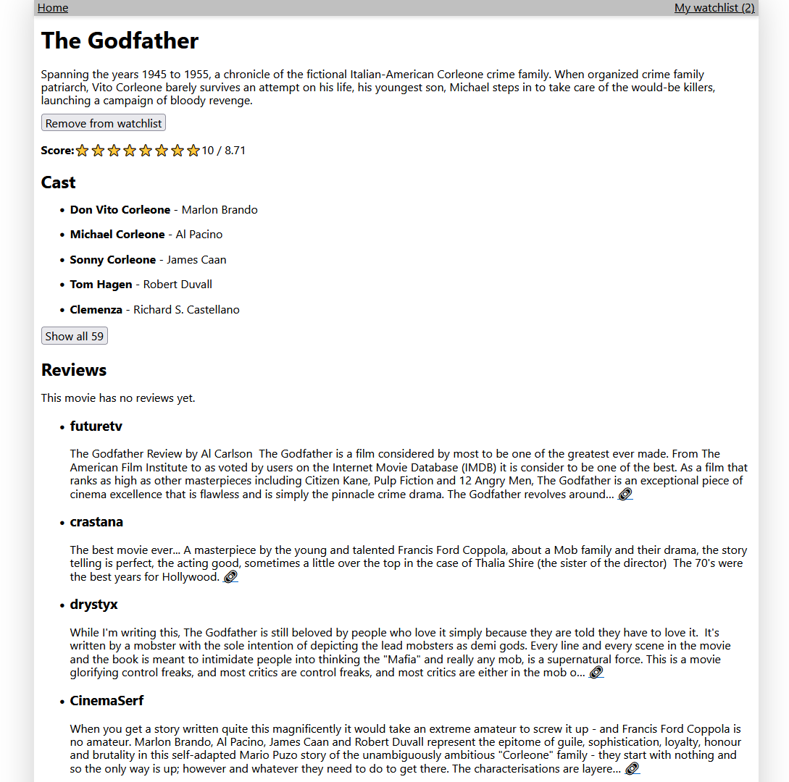

# Film DB App (Angular 16)

This project was generated with [Angular CLI](https://github.com/angular/angular-cli) version 16.1.1.

- Run `ng serve` for a dev server. Navigate to `http://localhost:4200/`. The application will automatically reload if you change any of the source files.
- Run `ng build` to build the project. The build artifacts will be stored in the `dist/` directory.
- Run `ng lint` to run _eslint_.
- Run `npm run format` to reformat files with _prettier_.

## Notes

1. Apart from some rudimentary watchlist functions, this app is the same as the original.
2. The backend is absolutely minimal (a proxy), the watchlist is stored in a dumb local storage JSON string.
3. All components are standalone components (Angular 14+ feature), there's no _app.module.ts_.

## Screenshots

