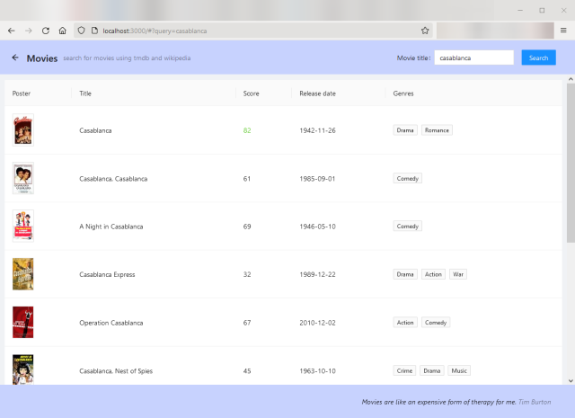
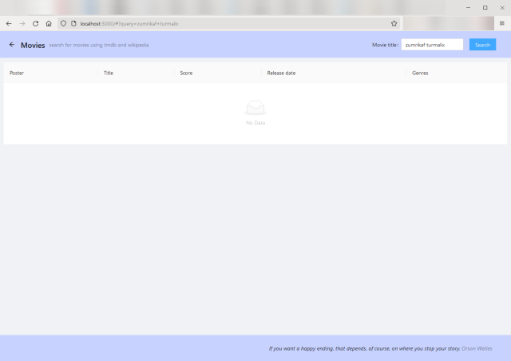
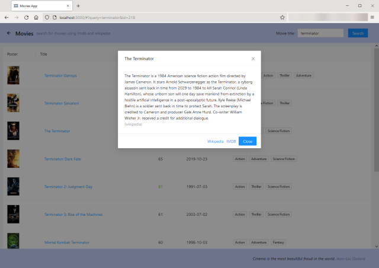
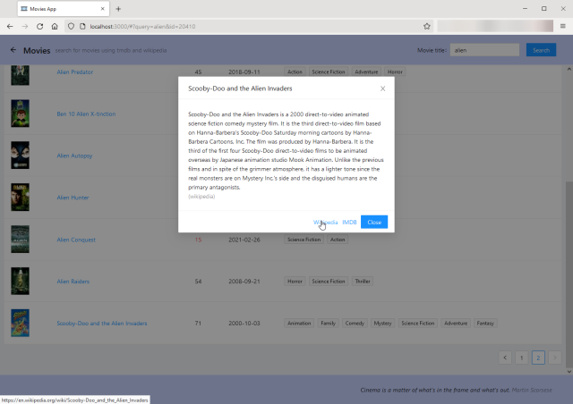

# biroda-entry

## user story

I, as a movie goer person, would like to be able to search for movies (using a free - as in beer - API)
and have a small description of the movie (from Wikipedia) along with links to my favorite sites,
which are IDMB and Wikipedia. I want these links to open in my browser, no apps please.

### definition of done

Project restraints:

1. have a **react frontend** that communicates with a **node backend**
2. source code shall be publicly available (use **github** or gitlab)
3. code, descriptions, UI, all of them shall be **in English**, additional localization is not needed
4. you can use 3rd party libraries (but NOT for masking away the API endpoints themselves)
5. design should be **clear, easily readable** (placement, paddings, margins, headings etc.)

Technical details:

1. must have a **search** field (for movie names), on button/key press it downloads
   search results from [TMDB](https://developers.themoviedb.org/3/getting-started/introduction)
2. results are shown in a **list** (name, category, score etc.), list **items are clickable**
3. on item click it opens/shows a **details panel**
   1. with the Wikipedia short description (using the Wikipedia API)
   2. with link to the Wikipedia article (target: blank)
   3. with link to the IMDB movie page (target: blank)

### optional improvements

1. add a third link called **"related movies"** (aka. similar movies) which changes
   the search result view to a related movies list
2. add tests

---

## implementation

These are my notes, reactions and musings during development.

### server

- I haven't got enough experience with ts on the server (unfortunately), so this is
  vanilla js (with the new module system), if I had to choose a node server side
  framework, [nestjs](https://nestjs.com/) looks really nice and I'm really looking
  for [deno](https://deno.land/)
- Validation and error handling are absolutely minimal.
- I used **apiary/aglio** for API documentation before (which is a format above markdown),
  but I'm sure there are much better tools out there these days.
- We used **got** when **request**'s lifecycle ended, but it's a bit awkward; real
  fetch is still behind feature flag, isomorphic fetch _was_ popular at times,
  but I'm not sure what's the greatest and latest in node world nowdayjs.
  What I know is that in the browser I'm absolutely tired of fetch's quirks.

### client

- I used **Fluent** and **Material** (long ago) for components before, now I wanted to try
  something different and I remember people talking about [ant](https://ant.design/),
  but I'm not sure if I like it:
  - No jss, css is global, customization is done via less, not in code.
  - I do miss some of the basic style settings (like centering content) via props.
  - String component props are types and not enums.
- No **CRA** (Create React App): I used to like tinkering with webpack without CRA, but these
  days CRA seems to be the norm, which may or may not be a good thing.
- Why **axios**? Simply because at work we use fetch and my hatred towards fetch
  grew stadily over the years; the amount of quirks with fetch puts it into league of XMLHttp.
- Why no **redux**? While I love redux (especially redux toolkit) I decided against it
  the project being so small - without a store it would be much harder to extend of course.
- Why no **react-router**? The task (imo) implied a single page, but I wanted to fool around
  a bit with good old hash location - but of course, as always, good routing is very hard
  to do (html5 history, first routing, back button support, avoiding unneeded rerenders),
  etc.

### screenshots

