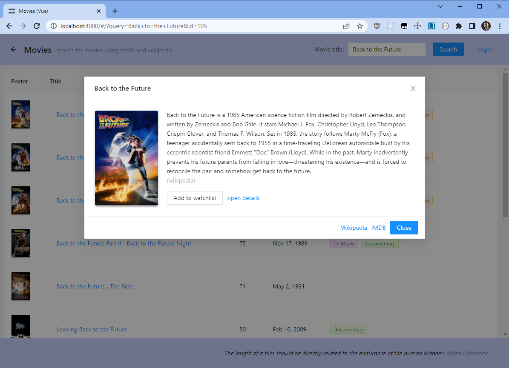

This is the port of "2022-04-biroda" react project to Vue 3 (with Vite).

- Client: `cd client`, `npm i`, `npm run dev`
- Server: `cd ../2022-04-biroda/server`, `npm i`, `npm run dev`

## Frontend

1. landing page:  
   
2. search results:  
   
3. short details:  
   
4. details page:  
   
5. login modal:  
   
6. loggged in:  
   
